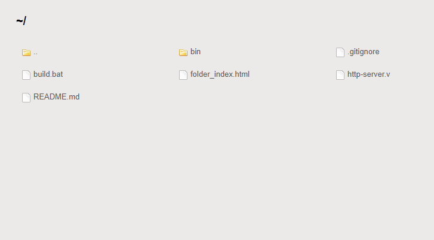

# HTTP Server

Start an http server to browse files in a directory

This program was made with [v](https://vlang.io). V is a relatively new language and I love it for its simplicity and 
speed.

The main reason I made this project is to challenge myself and to understand http at a lower level.

## Screenshots
Folder index page



## Usage
```
http-server v1.0.1
-----------------------------------------------
Usage: http-server [options] [ARGS]

Description: A simple http server

Options:
  -p, --port <int>          The port number
  -d, --dir <string>        The root directory of the server
  -h, --help                display this help and exit
  --version                 output version information and exit
```
### Locally
```
v run http-server.v
```

### Build to exe
```
v http-server.v
```
or
```
v -prod http-server.v
```

